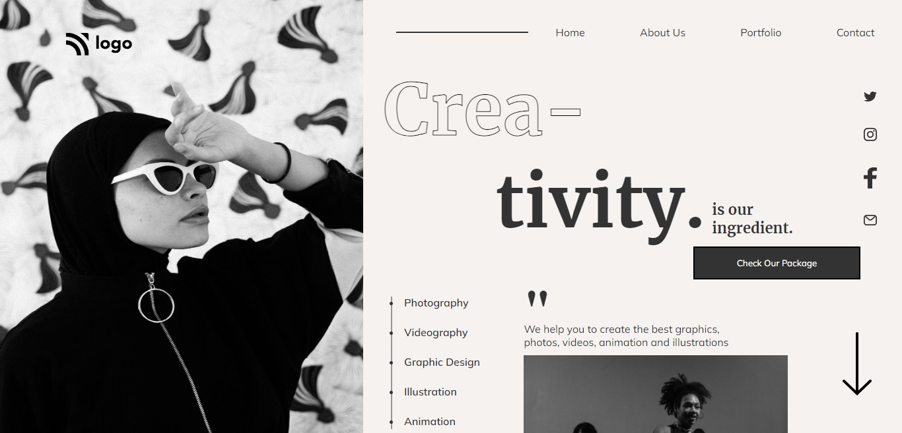

# Assignment 1

## Project 14 [Live Link](https://nachiketkeripaleproject14.netlify.app/)

- Build this project from strach.
- Used Flex and Positions in this project.
- Learnt to align multiple section.
- Used 
- Used svg files.
- Used Goolge Fonts for this project.

---

## Time taken to finish this project

-   5 hour to complete it.

#### Screenshot

 

